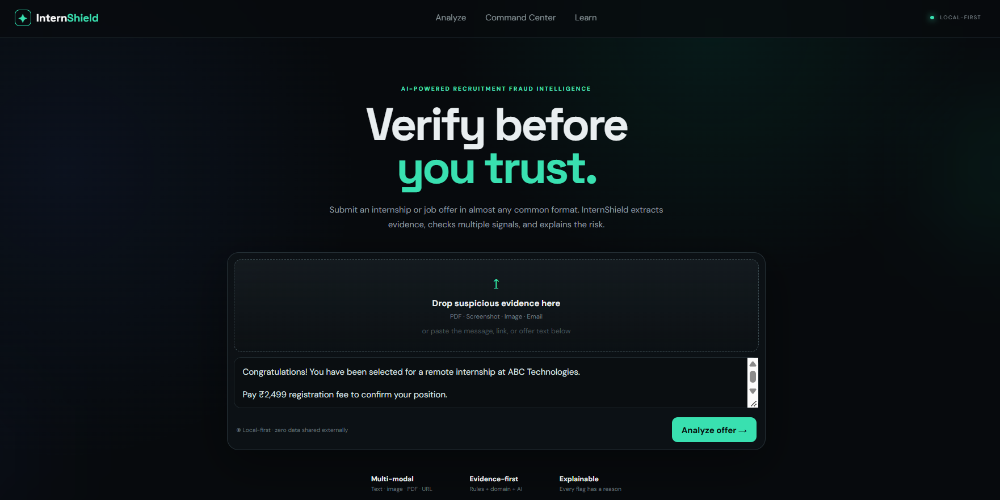
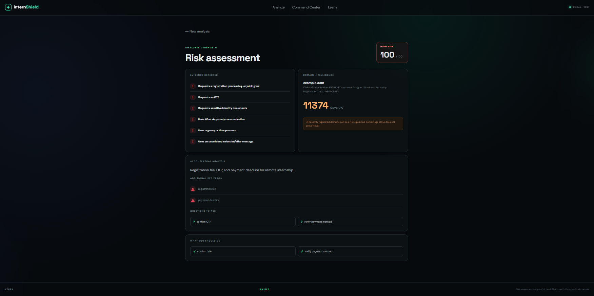
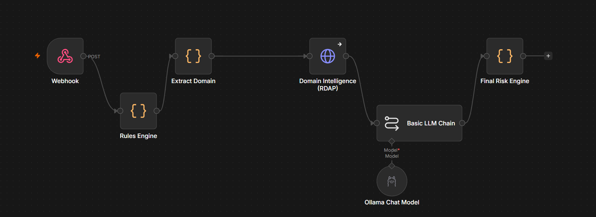

# InternShield

## AI-Powered Recruitment Fraud Intelligence

<p align="center">
  <strong>Verify before you trust.</strong><br>
  An evidence-first system for analyzing suspicious internship and job offers.
</p>

---

## Overview

InternShield combines deterministic fraud signals, URL/domain intelligence, and local AI analysis to produce an explainable recruitment-risk assessment.

Instead of relying on a black-box AI decision, the system shows **why** an offer is suspicious and what the user should do next.

---

## Product

### Analyze suspicious offers



Users can submit internship or job-offer text containing suspicious claims, payment requests, verification requests, URLs, or other recruitment-related content.

### Explainable risk assessment



The result page provides:

- **0–100 risk score**
- **LOW / MEDIUM / HIGH** classification
- Evidence detected by deterministic rules
- URL/domain intelligence
- Local AI contextual analysis
- Additional red flags
- Questions to ask
- Recommended safety actions

### n8n + AI workflow



---

## How It Works

```text
User submits internship/job offer
                ↓
           n8n Webhook
                ↓
          Rules Engine
                ↓
      URL / Domain Extraction
                ↓
       RDAP Domain Intelligence
                ↓
     Local Ollama AI Analysis
                ↓
         Final Risk Engine
                ↓
      Explainable Risk Report
```

The final risk score is produced by the deterministic risk engine. Ollama provides contextual analysis rather than independently deciding the numeric score.

---

## Key Features

- 0–100 risk scoring
- LOW / MEDIUM / HIGH classification
- Registration and payment-fee detection
- OTP request detection
- Sensitive identity-document detection
- WhatsApp-only communication detection
- Urgency and time-pressure detection
- Unsolicited offer detection
- URL extraction
- RDAP domain intelligence
- Domain registration-date analysis
- Domain-age calculation
- Recently registered-domain signal
- Local AI analysis with Ollama + Qwen2.5:1.5b
- Additional AI-detected red flags
- Verification questions
- Safety recommendations
- Explainable results

---

## Technology Stack

| Technology | Purpose |
|---|---|
| React | Frontend |
| Vite | Development and build |
| JavaScript | Application logic |
| n8n | Workflow orchestration |
| Ollama | Local AI runtime |
| Qwen2.5:1.5b | Local AI model |
| RDAP | Domain intelligence |
| Cloudflare Quick Tunnel | Temporary public demo access |

---

## Risk Assessment

InternShield uses heuristic evidence scoring.

| Signal | Weight |
|---|---:|
| Registration / payment fee | +30 |
| OTP request | +30 |
| Sensitive identity documents | +20 |
| WhatsApp-only communication | +10 |
| Urgency / time pressure | +10 |
| Unsolicited offer | +5 |
| Recently registered domain | +20 |
| Suspicious recruitment-domain pattern | +15 |

The final score is capped at **100**.

```text
0–30     LOW
31–70    MEDIUM
71–100   HIGH
```

> The score is a heuristic risk indicator, not a statistically calibrated probability of fraud.

---

## Local Setup

### 1. Start Ollama

Make sure Ollama is installed and the model is available:

```bash
ollama run qwen2.5:1.5b
```

### 2. Start n8n

```bash
npx n8n
```

Open:

```text
http://localhost:5678
```

The InternShield workflow should expose:

```text
POST /webhook/internshield
```

### 3. Start the frontend

```bash
cd frontend
npm install
npm run dev
```

Open:

```text
http://localhost:5173
```

---

## Example Detection

```text
Congratulations! You have been selected for a remote internship.

Pay ₹2,499 registration fee to confirm your position.

Send your Aadhaar card, PAN card, and OTP to our HR manager on WhatsApp.

Complete the payment within 30 minutes or your internship will be cancelled.

Apply here: https://example.com/verify
```

Possible evidence:

```text
⚠ Registration / payment fee
⚠ OTP request
⚠ Sensitive identity documents
⚠ WhatsApp-only communication
⚠ Urgency / time pressure
⚠ Unsolicited selection message
```

Example result:

```text
HIGH RISK
100 / 100
```

---

## Privacy

InternShield is designed around a local-first architecture.

During local execution, the AI analysis is performed by Ollama and Qwen2.5:1.5b on the local machine instead of requiring a paid external AI API.

Users should still avoid submitting unnecessary personal information.

---

## Live Demo

**Public demo:**

https://translations-varieties-assignment-circuit.trycloudflare.com

> The live demo uses a temporary Cloudflare Quick Tunnel connected to the local development environment. The demo is available only while the local services, frontend, and tunnel remain active.

---

## Source Code

**GitHub:**

https://github.com/CodeeSAI/InternShield

---

## Project Structure

```text
InternShield/
├── frontend/
│   ├── src/
│   ├── package.json
│   ├── vite.config.js
│   └── index.html
├── images/
│   ├── home.png
│   ├── result.png
│   └── architecture.png
├── .gitignore
└── README.md
```

---

## Current MVP

The verified MVP supports:

- Text-based internship/job-offer analysis
- Evidence-based risk scoring
- URL/domain extraction
- RDAP domain intelligence
- Local Qwen AI analysis
- Additional red flags
- Verification questions
- Safety recommendations
- Explainable results

---

## Future Scope

- Screenshot and image analysis
- PDF analysis
- Email analysis
- Telegram-based analysis
- Persistent analysis history
- Expanded scam-intelligence database
- More advanced multimodal detection
- Permanent cloud deployment

---

## Safety Disclaimer

InternShield provides an evidence-based risk assessment and is not a guarantee that an offer is legitimate or fraudulent.

Users should independently verify organizations through official websites and trusted communication channels before sending money or sensitive information.

---

<p align="center">
  Built for safer internship and job discovery.
</p>
